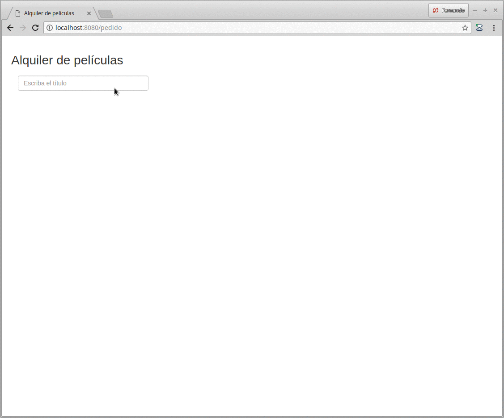
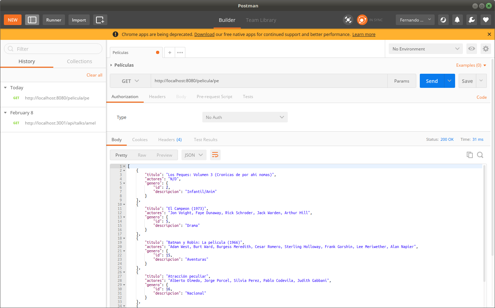

# Carrito de películas - Grails 3

El presente proyecto muestra una aplicación que permite generar un carrito de compras / alquiler de películas.



# Tecnologías

- Grails 3.3.3
- desarrollado en IntelliJ IDEA Ultimate 2017.3.5 con plugin de Grails
- contra una base MySQL Ver 14.14 Distrib 5.7.21

# Objetivo

## Interfaz de usuario

Inicialmente la pantalla tiene una búsqueda con autocompletado (que JQuery 2.2.0 ya no provee, así que tuvimos que buscar un [componente externo](https://goodies.pixabay.com/jquery/auto-complete/demo.html)).
Esto dispara una búsqueda asincrónica al servidor. Grails ofrece un servicio REST que devuelve un JSON en base al criterio,
busca por título y devuelve un json con las posibles películas. Para testear por afuera puede probarse

> http://localhost:8080/peliculas/pe

Esto produce el siguiente output:



El JSON luego es procesado por el cliente para mostrar la lista de opciones, y al seleccionar una película se dispara
la búsqueda al servidor con dicho id. Este servicio devuelve ya no un JSON, sino un HTML que se ubica en un **template**,
lo que permite reutilizar luego la forma en que se visualiza una película.

Cuando el usuario decide agregar la película al carrito, se produce una nueva llamada al servidor que 
pasa el pedido y la película elegida, y el servidor Grails arma la lista de películas que componen el
pedido. Para ello, delega dentro del gsp al template que muestra una película, con la posibilidad de
eliminarla del pedido.

## Persistencia

Otra de las ideas del ejercicio es mostrar cómo funciona la técnica de ActiveRecord de Grails, con la cual no
es necesario tener un repositorio para agregar, actualizar o eliminar un objeto mapeado de la base.

Esto puede verse por ejemplo en la clase PedidoService, cuando decide agregar una película a un pedido:

```groovy
    def agregarPelicula(Pedido pedido, Pelicula pelicula) {
        pedido.addToPeliculas(pelicula)
        pedido.save(failOnError: true, flush: true)
    }
```

Dos cosas son manejadas por GORM (Grails Object/Relational Mapping):

- el addToPeliculas que maneja las relaciones bidireccionales que pudiera haber
- y el save de un objeto pedido, que es un **domain class**, es decir una clase con capacidades especiales, decorada
por Grails para incorporarle estos métodos.

A su vez la transaccionalidad es manejada por los services en forma declarativa, como podemos ver 
en el ejemplo:

```groovy
@Transactional
class PedidoService {

    @Transactional(readOnly=true)
    def getPedido(Long id) {
        Pedido.get(id)
    }

    def agregarPelicula(Pedido pedido, Pelicula pelicula) {
        //
    }
```

Aquí se establece que los métodos en PedidoService serán transaccionales por defecto (como en el caso
de agregar o eliminar película). Para el método que obtiene un pedido en base al identificador,
queremos que no se genere una transacción (que tiene un costo de posible rollback y además de bloqueo de recursos).
Entonces modificamos la configuración por defecto para que trabaje con una transacción read-only.

Cualquier excepción que ocurra en los métodos del service automáticamente hace un rollback de la transacción
activa. Entonces el controller que usa el service está seguro de que todas las operaciones involucradas
al agregar una película a un pedido ocurren en conjunto.

Por último, vemos que la clase Pedido, al ser GORM, se decora con métodos static (de clase) para realizar
las búsquedas. En particular se puede hacer una búsqueda por cada atributo que definamos. Por ejemplo en
Película es posible hacer:

- get(id)
- findById(Long id)
- findByTitulo(String titulo)
- findByGenero(Genero genero)
- findByTituloAndGenero(String titulo, Genero genero)
- etc.

